# SeatMap — User Guide

SeatMap runs a wedding from floor plan to photo wall. There are three kinds of
people in the flow, and each gets their own surface:

| Who | What they use | Where |
|---|---|---|
| **Planner (admin)** | Venue editor, events, guests, seating, menu, photo moderation | `/venues`, `/events` |
| **Greeter (door staff)** | Offline check-in tablet | `/greeter` |
| **Guest** | RSVP page + personal table page on their own phone | `/rsvp/…`, `/g/…` |

The golden thread: **map the venue once → create an event on it → collect
guests → seat them → print QRs → check in at the door → guests find their
table and share photos.**

---

## Part 1 — Planner: set up the venue (once per hall)

### 1.1 Venue library

Open **Venues** and add the hall by name (e.g. "Grand Ballroom @ Hilton KL"),
then create a **layout** for it. A venue holds the physical room (walls, door,
stage); layouts hold table arrangements — one venue can have many layouts
(300-pax banquet, 200-pax classroom…), and every future event at this hall
reuses them with zero re-tracing.

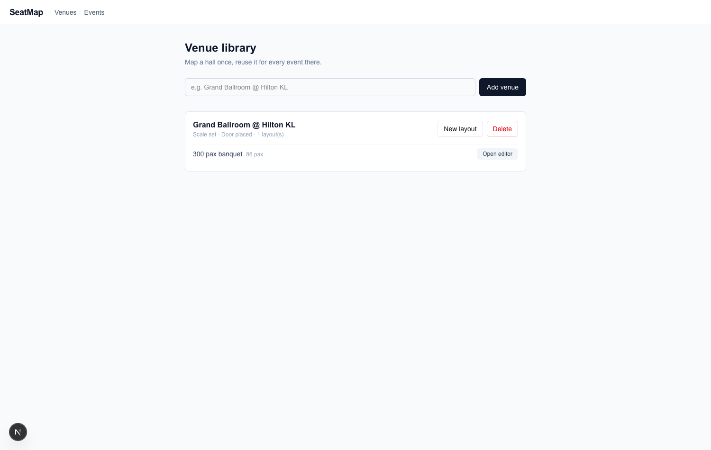

### 1.2 The hall editor

Opening a layout lands in the editor: a 4-step rail on the left, the 2D floor
plan in the middle, a live 3D preview and inspector on the right.

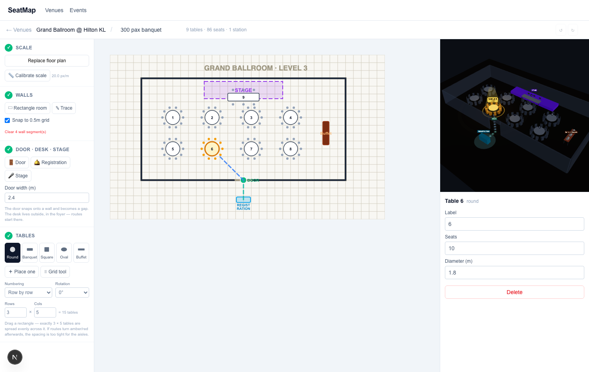

Work top-to-bottom through the rail:

1. **Scale** — upload the venue's floor plan (PNG/JPG/PDF), click *Calibrate
   scale*, drag a line along something you know the length of (a wall, a
   doorway) and type the metres. **Everything else stays locked until this is
   done** — without a scale, a "1.8 m table" means nothing.
2. **Walls** — *Rectangle room* draws a whole room in one drag (covers most
   ballrooms); *Trace* clicks out irregular corners, double-click to close.
3. **Door · desk · stage** — click a wall to place the **door** (it snaps onto
   the wall and becomes a gap); place the **registration desk** outside in the
   foyer (guest walking routes start there); drag out the **stage**.
4. **Tables** — pick a shape (Round / Banquet / Square / Oval / **Buffet**),
   then either *Place one* per click, or use the **Grid tool**: set Rows ×
   Cols, drag a rectangle, and exactly that many tables appear evenly spaced
   and auto-numbered (row-by-row, serpentine, or by column). Buffets are
   *service stations* — they never take a table number and never count as
   seats.

Everything is editable afterwards: drag tables (marquee-select several and
move them together), click any object to edit it in the inspector (seats,
size, rotation), copy/paste with **⌘C/⌘V**, undo with **⌘Z**, and drag the
door/desk/stage to reposition them.

**Click any seating table** to preview the guest walking route — desk → door →
table, threading the aisles. If a table gets boxed in, the route turns **red**
with "NO WALKABLE ROUTE" and a warning lists it in the rail: fix it before
wedding day.

---

## Part 2 — Planner: run an event

### 2.1 Create the event

**Events → fill couple, date, venue, layout → Create event.** One wedding =
one event on one layout.

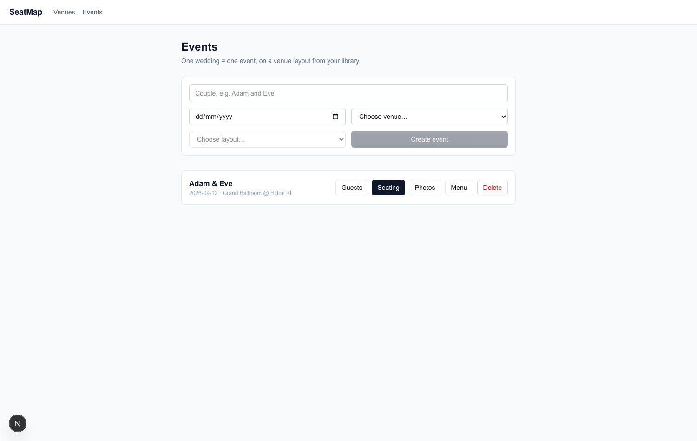

### 2.2 Dinner menu (optional)

**Menu** on the event card. Add courses in serving order — name, optional
description (Chinese renders fine), optional dish photo. There's an 8-course
banquet preset to start from. Guests see this on their phones.

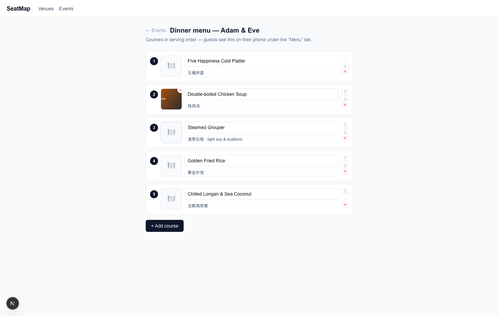

### 2.3 Collect guests — two ways that mix freely

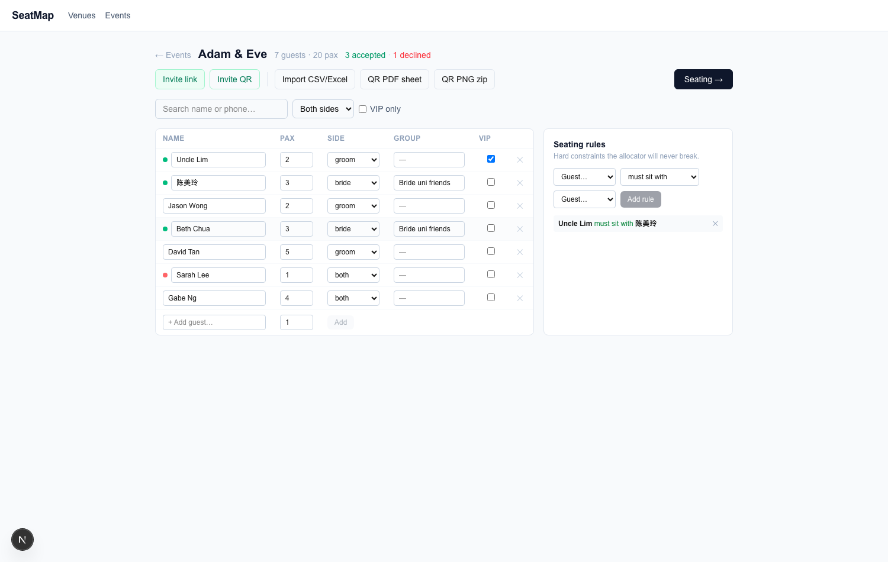

- **Invite link / Invite QR** (green buttons) — one public e-invitation link
  for the whole event. Blast it on WhatsApp; each person who opens it RSVPs
  and is **added to the guest list automatically** (deduped by phone number,
  so an RSVP from someone you already imported updates them instead of
  duplicating). Accepted/declined counts show in the header; declined guests
  are kept for the record but never seated.
- **Import CSV/Excel** — messy spreadsheets welcome: headers like "Guest
  Name", "No. of Pax", "名字" are auto-detected, with a preview and manual
  column mapping before anything is committed.
- Or just type into the **+ Add guest…** row.

On the right, add **seating rules**: *must sit with* / *must NOT sit with*
pairs. The allocator treats these as unbreakable.

### 2.4 Seating

**Seating →** opens the allocation board, drawn as your actual floor plan —
stage, door, registration desk and buffets included. Table colours show fill
state (white empty · blue partial · green full · red over capacity).

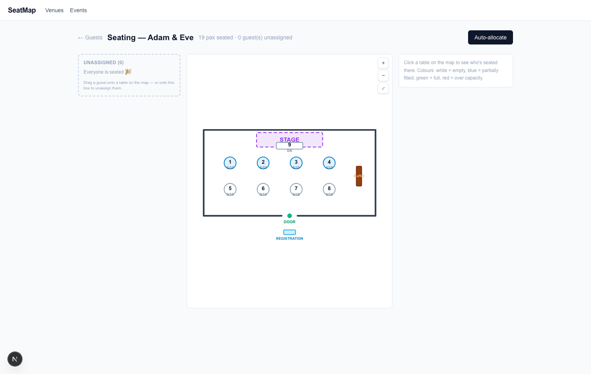

- **Auto-allocate** seats everyone at once: rules honoured, VIPs nearest the
  stage, groups clustered, party sizes counted.
- Drag any guest chip from *Unassigned* straight onto a table on the map —
  or click a table to manage its guests in the side panel. **Lock** (🔒) a
  guest to pin them through future re-runs.
- Scroll pans, **⌘/Ctrl+scroll** zooms, and the +/−/⤢ buttons fit the room.

### 2.5 Print the guest QR codes

Back on the Guests page: **QR PDF sheet** (A4 cards with cut lines, one per
guest) or **QR PNG zip** (one image per guest, named after them, for invite
designs). Codes are permanent — reprint any time, reshuffle seating any time;
the code identifies the *guest*, and the table is looked up live.

### 2.6 Photos on the night

**Photos** on the event card is the moderation queue: everything guests upload
waits here for a human ✓ before it can reach the ballroom projector (an AI
pre-filter runs first when configured). ✗ hides a photo from the feed and
screen — the couple's **album ZIP** still keeps everything.

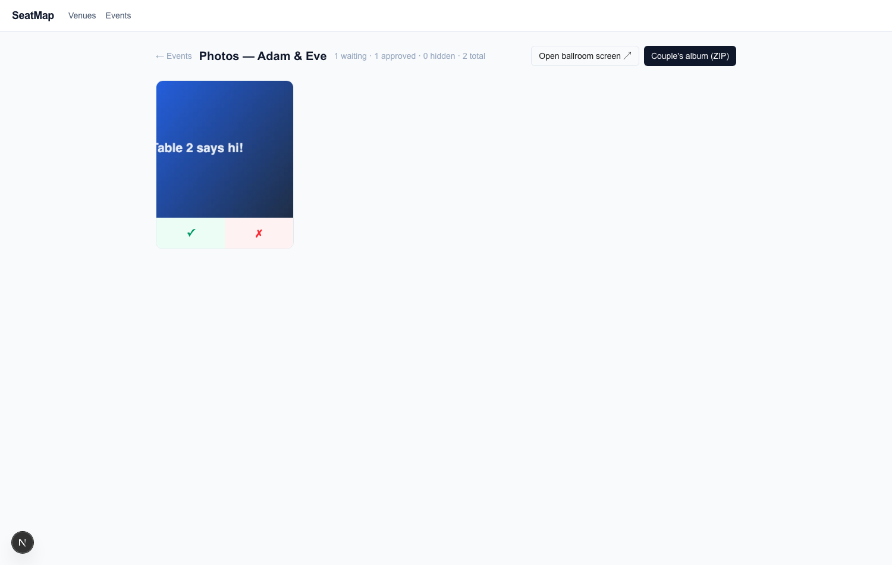

Open **ballroom screen ↗** on the projector laptop: approved photos play as a
full-screen slideshow with the couple's names, and it caches locally so a
wifi blip never blanks the screen.

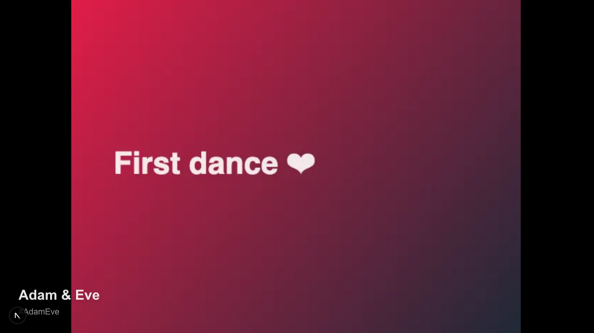

---

## Part 3 — Greeter: the door tablet

Open **`/greeter`** on the tablet **while still on wifi** and tap the event.
This caches the entire guest list, tokens and table layout onto the device —
after this moment the tablet needs **zero bars**.

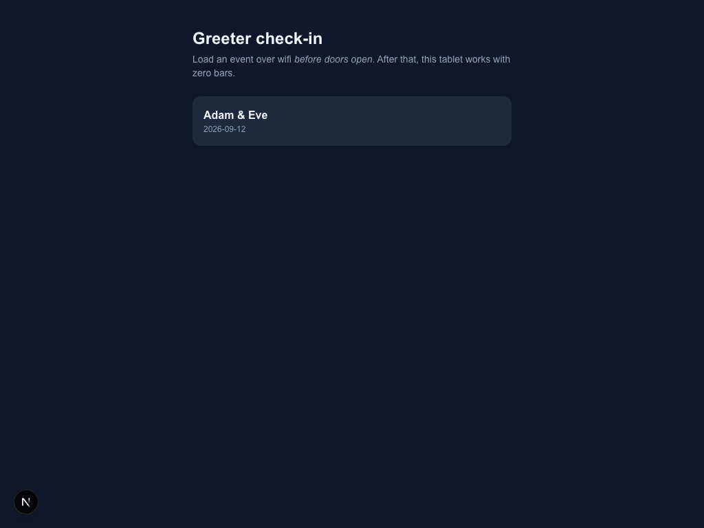

At the door:

- **Scan** the guest's QR (or paste/type the code) → their name and a huge
  **TABLE N** appear, and they're checked in. Duplicate scans warn instead of
  double-counting; forged codes are rejected — all verified locally, offline.
- **Search** by name or phone for the uncle who lost his invite; tap to check
  in.
- **Walk-in** adds an uninvited guest and seats them at a table with space.
- **Tables** shows live per-table arrival counts.
- **Undo** fixes accidental scans.

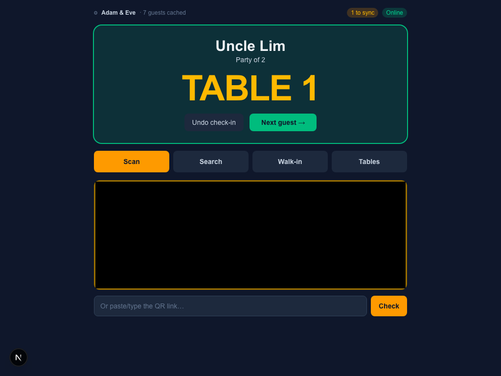

Everything queues on the device ("N to sync") and pushes automatically when
connectivity returns — resubmissions are harmless, and the earliest check-in
time wins.

> If you change seating after loading the tablet, tap through `/greeter` →
> the event again to refresh the cache before doors open.

---

## Part 4 — Guest: their own phone

### 4.1 RSVP (before the wedding)

The invite link opens a mobile invitation: name, phone, seats needed, side,
accept/decline. Submitting puts them on the planner's guest list instantly.

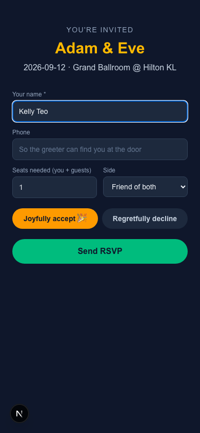

### 4.2 Find my table (on the day)

Scanning **their own QR** (the same one the greeter scans) opens their
personal page: **TABLE N** in giant type, plain-language directions, and a 3D
hall that flies in to their glowing table with an animated walking route from
the registration desk, through the door, around the other tables. Phones
without WebGL get a 2D map with the same highlight — never a blank screen.

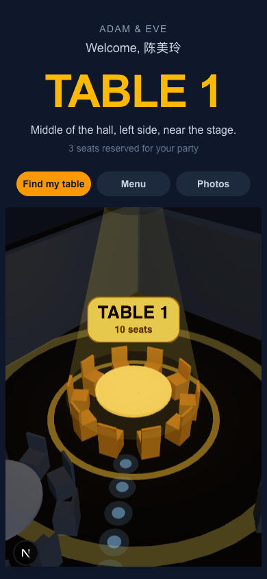

### 4.3 Menu & photos

Two more tabs: **Menu** (the courses in serving order, with photos) and
**Photos** — guests upload from camera or gallery (several at once), photos
are resized on-device, and approved ones join the live feed and the ballroom
screen.

| Menu | Photos |
|---|---|
| 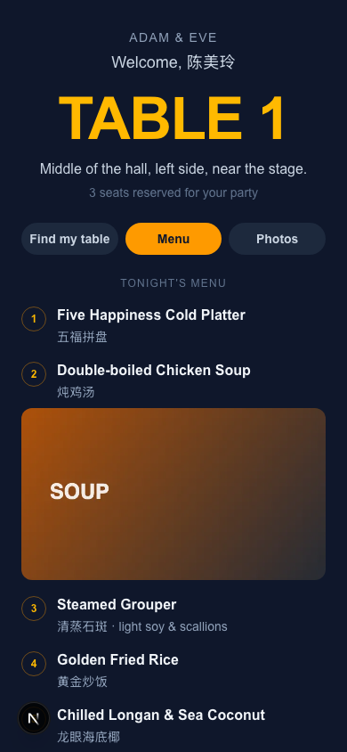 | 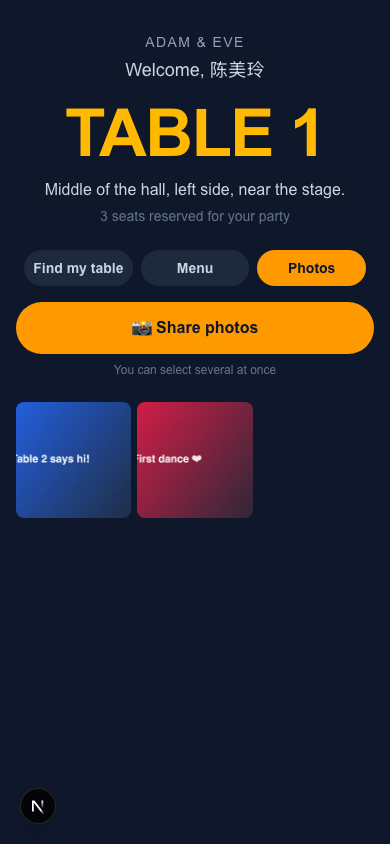 |

---

## Quick reference

| I want to… | Go to |
|---|---|
| Map a new hall | Venues → add venue → New layout |
| Start a wedding | Events → Create event |
| Send invitations | Guests → **Invite link / Invite QR** |
| Import a spreadsheet | Guests → Import CSV/Excel |
| Seat everyone | Seating → Auto-allocate (then drag to taste) |
| Print door QRs | Guests → QR PDF sheet / QR PNG zip |
| Set the dinner menu | Event card → Menu |
| Moderate photos / projector | Event card → Photos → Open ballroom screen |
| Check guests in | `/greeter` on the tablet (load before doors open) |

**Note on the demo setup:** without Supabase credentials the app stores
everything in the browser (per-origin). That's perfect for trying the flows
on one machine; for a real event with many phones, configure
`NEXT_PUBLIC_SUPABASE_URL` / `NEXT_PUBLIC_SUPABASE_ANON_KEY` and apply
`supabase/migrations/0001_init.sql`.
